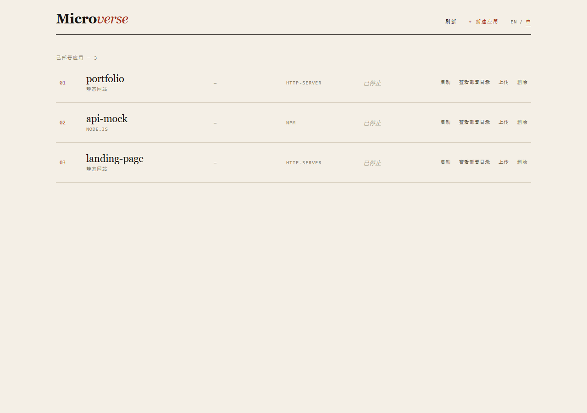
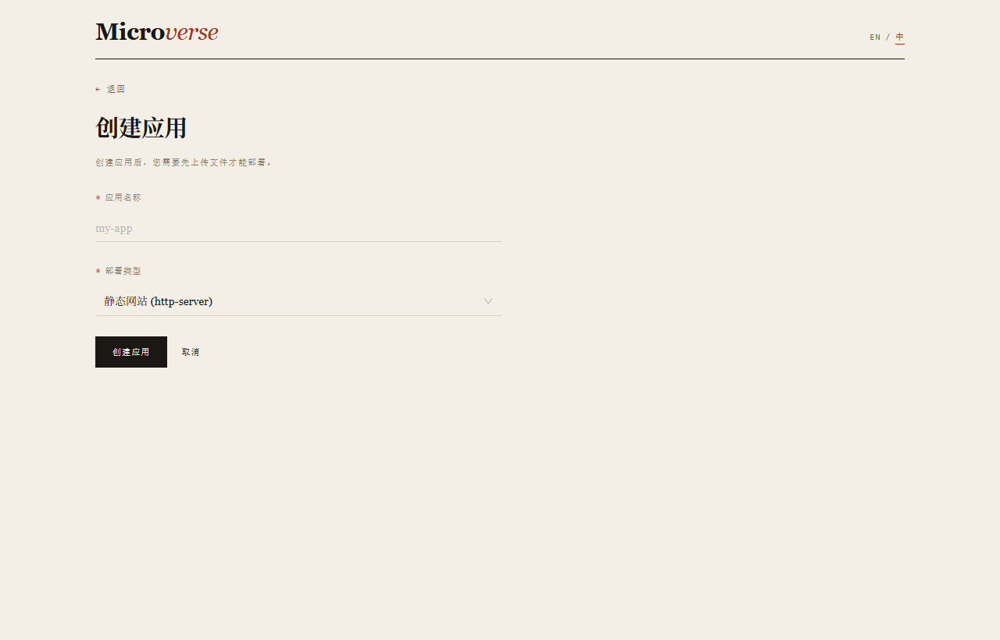
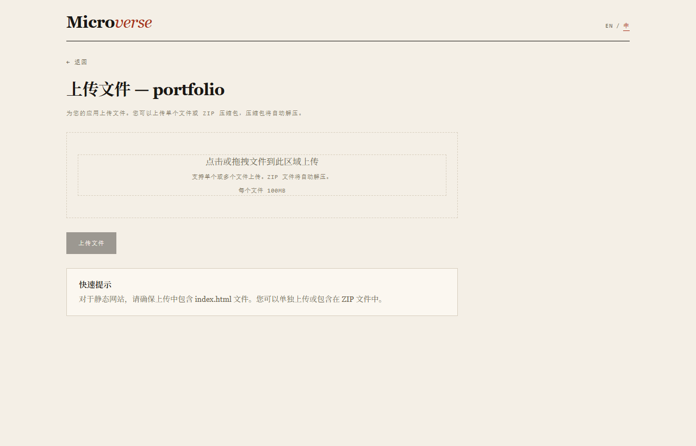

#  Microverse

> Deploy and manage your micro applications with ease

A web-based platform for deploying and managing micro applications. Create, upload, and deploy multiple small web applications with different runtime environments (npm, http-server, nginx) through a single web interface — so the long tail of one-off static sites and tiny Node services has one home instead of a dozen half-forgotten ports.

## Features

- 📁 **Application Management**: Create and organize applications in dedicated directories
- 📤 **Drag-and-drop Upload**: Upload individual files or a ZIP archive (auto-extracted on upload)
- 🚀 **Multiple Deploy Options**:
  - `http-server` — for static sites (requires `index.html`)
  - `npm` — for Node.js applications (requires `package.json` with a `start` script; auto-runs `npm install` + optional `npm run build` on start; platform assigns a port and injects `PORT` + your env vars)
  - `nginx` — for static sites served by nginx (requires nginx installed; set `NGINX_BIN` if not on `PATH`)
- 🔗 **Central Dashboard**: View and access every deployed application from one place
- ⚙️ **Port Management**: Automatic port allocation in a configurable range (3000–9000 by default)
- 📊 **Status Sync**: `Live` / `Idle` status, reconciled with actual PM2 process state
- 🔒 **Admin Login**: the dashboard and API are gated behind a single admin session (set `ADMIN_USERNAME`/`ADMIN_PASSWORD` in `.env`; the password is bcrypt-hashed on first boot)
- 📜 **Live Logs**: stream each app's PM2 stdout/stderr from a dedicated logs page — recent history on open, then new lines in real time
- 📈 **Resource Metrics**: per-app CPU / memory / uptime — inline on the dashboard and on a dedicated metrics page with sparkline history (sampled every 10s)
- 🌐 **Bilingual UI**: Chinese / English toggle, persisted per browser
- 🎨 **Editorial Interface**: warm-paper, serif/mono, single accent — a deliberate, non-template look (see [design spec](docs/superpowers/specs/2026-06-28-editorial-ui-redesign-design.md))

## Screenshots

**Dashboard** — apps as numbered editorial rows (shown here in `Idle` state; running apps show a red `Live` status and a clickable port chip that opens the deployed app):



**Create Application** — underline inputs, hairline select, ink submit button:



**Upload Files** — paper dropzone with the live per-file size limit (`100MB per file`, fetched from `GET /api/config` and driven by `MAX_FILE_SIZE`):



## 📚 Documentation

**New to Microverse?** Start here:
- 📖 [Installation & Usage Guide](README.md) - You're here
- 🚀 [Quick Start Guide](#quick-start) - Get up and running in 5 minutes

**For Developers:**
- 🏗️ [Architecture & Development Guide](CLAUDE.md) - Understand the codebase architecture
- 📋 [Development Progress](PROGRESS.md) - Current status and roadmap
- 🔄 [Daily Workflow Guide](WORKFLOW.md) - How to start/end your workday
- 📚 [Documentation Index](DOCS.md) - Complete documentation overview
- 🎨 [UI Design Spec](docs/superpowers/specs/2026-06-28-editorial-ui-redesign-design.md) - Editorial redesign

## Quick Start

### Prerequisites

- Node.js >= 18.0.0
- npm >= 9.0.0
- [PM2](https://pm2.keymetrics.io/) installed globally (`npm install -g pm2`) and, for `http-server` static deploys, `http-server` globally (`npm install -g http-server`)

### Installation

1. Clone the repository:
```bash
git clone <repository-url>
cd microverse
```

2. Install dependencies:
```bash
npm run install:all
```

3. Create environment configuration:
```bash
cp .env.example .env
```

4. Start development servers:
```bash
# Start both frontend and backend in development mode
npm run dev

# Or start them separately:
npm run dev:server  # Backend on http://localhost:5000
npm run dev:client  # Frontend on http://localhost:5173
```

5. Open your browser and navigate to `http://localhost:5173`

### Production Deployment

1. Build the frontend:
```bash
npm run build:client
```

2. Start the backend with PM2:
```bash
cd server
npm run pm2:start
```

3. Monitor the application:
```bash
cd server
npm run pm2:logs
```

## Usage

### Creating an Application

1. Click **+ New app** in the top nav
2. Enter a unique application name (alphanumeric, dash, and underscore only)
3. Select a deployment type:
   - **Static Site (http-server)**: For HTML/CSS/JS static websites
   - **Node.js (npm)**: For Node.js applications with a `package.json` `start` script (dependencies install and an optional build run automatically on start)
   - **Nginx**: For static sites, served by nginx (install nginx separately; set `NGINX_BIN` if not on `PATH`)
4. Submit — the app appears on the dashboard as `Idle`

### Uploading Files

1. On an app's row, click **Upload**
2. Drag files onto the drop zone (or click to pick), including a `.zip` — archives are extracted automatically on upload
3. Allowed types: HTML, CSS, JS, JSON, TXT, MD, images (JPG/PNG/GIF/SVG/ICO), ZIP
4. Click **Upload Files** — you return to the dashboard

### Deploying & Accessing

1. Click **Start** on the app row — a port is assigned automatically. For **npm** apps the first start also runs `npm install` (and `npm run build` if a build script exists), so the button shows **Starting…** until the process is live.
2. The status flips to **Live** and the port becomes a clickable chip
3. Click the port chip to open the deployed app at `http://localhost:<port>`
4. Use **Stop** to take it back to **Idle**

### Managing Applications

- **Start / Stop**: Toggle an app's process via PM2
- **View Directory**: Inspect the deployed files in a modal
- **Upload**: Add or replace files
- **Logs**: Open the app's live log stream (stdout/stderr, history + real-time) on a dedicated page
- **Environment (npm only)**: Click **Environment** on an npm app's row to set key/value env vars (e.g. `API_KEY`). They're injected on the next start — change them, then restart. The platform also assigns each npm app a port and exposes it as `PORT`.
- **Delete**: Remove an app (must be stopped first; its PM2 entry is cleaned up)
- **Refresh**: Re-fetch the app list; status is reconciled with PM2 on each request via the sync endpoint

## Project Structure

```
microverse/
├── server/                 # Backend server
│   ├── src/
│   │   ├── app.js         # Express application entry point
│   │   ├── config/        # Configuration management
│   │   ├── db/            # Database (SQLite via sqlite3)
│   │   ├── routes/        # API routes
│   │   ├── services/      # Business logic (AppManager / ProcessManager / DeployManager)
│   │   ├── middleware/    # Express middleware (errors, upload)
│   │   └── utils/         # Utility functions (path-helper)
│   └── package.json
├── client/                # Frontend application
│   ├── public/
│   │   └── favicon.svg    # Editorial grid mark
│   ├── src/
│   │   ├── pages/         # React pages (Dashboard, CreateApp, UploadFiles)
│   │   ├── components/    # EditorialShell, AppRow, LanguageSwitcher
│   │   ├── api/           # API client
│   │   ├── i18n/          # zh / en locales
│   │   └── styles/        # index.css (palette + antd neutralization) + editorial.css
│   └── package.json
├── apps/                  # Deployed applications directory (runtime data)
├── data/                  # Database files (runtime data)
└── package.json           # Root workspace configuration
```

## API Endpoints

All endpoints return `{ success, data }` or `{ success: false, error: { message } }`.

> Interactive API docs (Swagger UI): `http://localhost:5000/api-docs` — raw spec at `GET /openapi.json`.

### Applications
- `GET /api/apps` - List all applications
- `GET /api/apps/:id` - Get an application by ID
- `POST /api/apps` - Create an application (body: `{ name, deploy_type }`)
- `DELETE /api/apps/:id` - Delete an application (must be stopped)
- `POST /api/apps/:id/start` - Start (assigns a port, launches via PM2)
- `POST /api/apps/:id/stop` - Stop
- `POST /api/apps/:id/restart` - Restart
- `POST /api/apps/:id/sync` - Reconcile DB status with actual PM2 process state
- `GET /api/apps/:id/files` - List the application's deployed files
- `POST /api/apps/:id/upload` - Upload files (`multipart/form-data`, field `files`; ZIPs auto-extract)
- `GET /api/apps/:id/logs/stream` - Live log stream (SSE; emits recent history then new lines; `?lines=N`, default 100)
- `GET /api/apps/:id/env` - List an app's environment variables
- `PUT /api/apps/:id/env` - Replace an app's environment variables (`{ env: [{ key, value }] }`; applies on next start)

### System
- `GET /api/health` - Health check
- `GET /api/config` - Public client configuration (upload limits)
- `GET /` - Server information

## Configuration

Copy `.env.example` to `.env` and adjust:

```env
# Server
PORT=5000
HOST=0.0.0.0
NODE_ENV=development

# CORS
CORS_ORIGIN=http://localhost:5173

# Database
# DB_PATH=./data/microverse.sqlite

# Deployed-app port range
APP_PORT_MIN=3000
APP_PORT_MAX=9000

# File upload limits
MAX_FILE_SIZE=104857600  # 100MB in bytes
MAX_FILES=100

# npm install / build timeouts (ms, default 300000)
NPM_INSTALL_TIMEOUT_MS=300000
NPM_BUILD_TIMEOUT_MS=300000

# nginx binary path for the nginx deploy type (default 'nginx' = PATH)
NGINX_BIN=nginx

# PM2
PM2_INSTANCE_NAME=microverse-server
```

> The per-file size limit is configured via `MAX_FILE_SIZE` (default 100MB), enforced by the upload middleware, and surfaced to the UI via `GET /api/config`.

## Cross-Platform Compatibility

Designed to work on both Windows and Linux:

- **Path handling**: Node.js `path` module everywhere (no string-concatenated paths)
- **Environment variables**: `cross-env` for Windows-compatible scripts
- **File operations**: `fs` APIs instead of shell commands
- **PM2 + Windows**: PM2 fork mode can't launch `.cmd` wrappers (npm, http-server), so `ProcessManager` resolves the JS entry points (`http-server/bin/http-server`, `npm/bin/npm-cli.js`) and runs them with `interpreter: 'node'`
- **nginx deploy type**: nginx is a system binary (not an npm package). Set `NGINX_BIN` (default `nginx`) to point at it; PM2 launches it with `interpreter: 'none'` and `daemon off;`. Per-app `pid`/`error_log`/`access_log` are redirected into the app directory so nginx doesn't need write access to its install prefix.
- **Database**: uses the `sqlite3` package (not `better-sqlite3`, which has Windows compilation issues)

## Development

### Backend Development
```bash
cd server
npm run dev
```

### Frontend Development
```bash
cd client
npm run dev
```

Lint and build the frontend:
```bash
cd client
npm run lint    # ESLint, --max-warnings 0
npm run build   # Vite production build
```

### Database

SQLite stores application metadata. The database file is created automatically at `data/microverse.sqlite` on first server start. To reset it, delete the file and restart the server.

## Troubleshooting

### Port already in use
- Stop the process using that port, or change `PORT` in `.env`

### PM2 commands not found
```bash
npm install -g pm2
# or
npx pm2 list
```

### Database errors
```bash
rm data/microverse.sqlite   # Linux/Mac
del data\microverse.sqlite  # Windows
npm run dev:server
```

## Technology Stack

- **Backend**: Node.js + Express + SQLite (`sqlite3`)
- **Frontend**: React 18 + Vite + Ant Design 5 + react-i18next
- **Process Management**: PM2
- **Cross-Platform**: `path` module, `cross-env`, platform-agnostic APIs

## License

MIT © [kuoluosaigai](https://github.com/kuoluosaigai)

---

**Organization**: [kuoluosaigai](https://github.com/kuoluosaigai) - 这个世界

**Project**: microverse - Deploy your micro worlds
